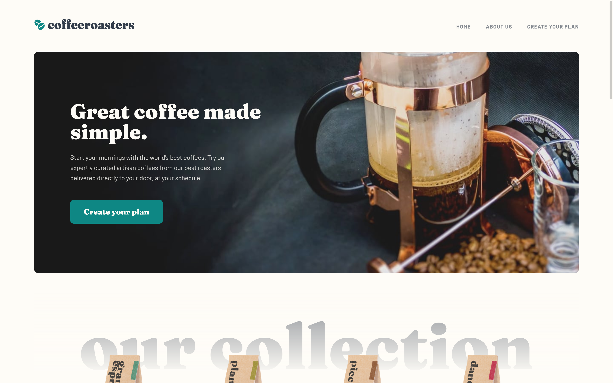

# Frontend Mentor - Coffeeroasters subscription site solution

This is a solution to the [Coffeeroasters subscription site challenge on Frontend Mentor](https://www.frontendmentor.io/challenges/coffeeroasters-subscription-site-5Fc26HVY6). Frontend Mentor challenges help you improve your coding skills by building realistic projects. 

## Table of contents

- [Overview](#overview)
  - [The challenge](#the-challenge)
  - [Screenshot](#screenshot)
  - [Links](#links)
- [My process](#my-process)
  - [Built with](#built-with)
  - [What I learned](#what-i-learned)
  - [Continued development](#continued-development)
  - [Useful resources](#useful-resources)
- [Author](#author)

## Overview

### The challenge

Users should be able to:

- View the optimal layout for each page depending on their device's screen size
- See hover states for all interactive elements throughout the site
- Make selections to create a coffee subscription and see an order summary modal of their choices

### Screenshot



### Links

- [Frontend Mentor - solution](https://www.frontendmentor.io/solutions/html-scss-vanilla-js-X-m36ak-n)
- [Live Demo](https://coffeeroasters-subscription-site-zeta.vercel.app/)

## My process

### Built with

- Semantic HTML5 markup
- SCSS
- Flexbox
- CSS Grid
- BEM methodology
- Mobile-first workflow
- Vanilla JavaScript + modules

### What I learned

- This was my first larger project - and although I took quite a bit of time to analise the design and plan out styles to make them reusable, I still came across some challenges. For example, I initially created separate styles for the how to section which appears on two of the pages, but in the final version, I used Sass `@extend` rule:

```scss
.how-to {
    max-width: 80rem;
    margin-bottom: 7.5rem;
    padding: 0 $inner-pad-sm;
    text-align: center;

    /* more styles */

.how-to--dark-bg {

    @extend .how-to;
    
    padding-top: 5rem;
    padding-bottom: 5rem;
    border-radius: $border-radius;
    background-color: $darkGreyBlue;
```

- I learnt how to use JavaScript modules - after I figured out all logic related to the subscription form, the JS file was very long and unreadable. I moved all functions into separate files.

### Continued development

In hindsight, I can see how not utilising a framework would make this multi-page websites difficult to maintain and update.

I will now be focusing on learning JS frameworks.

### Useful resources

- [Resizing svg images with viewBox attribute](https://css-tricks.com/scale-svg/) - This helped me a lot when I struggled with the logo image overflowing the container on smaller mobile screens

## Author

- Frontend Mentor - [@AgataLiberska](https://www.frontendmentor.io/profile/AgataLiberska)
- Twitter - [@AgataLiberska](https://www.twitter.com/AgataLiberska)
